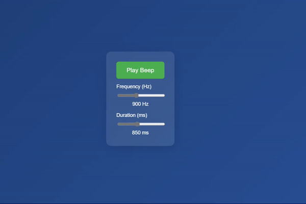

# Beep Generator

A simple, elegant web-based tone generator with a modern UI. This application allows users to create customizable beep sounds by adjusting frequency and duration parameters in real-time.

 
 

## Features

- 🎵 Generate pure sine wave tones
- 🎛️ Adjustable frequency (200-2000 Hz)
- ⏱️ Customizable duration (50-2000 ms)
- 🎨 Modern glass-morphism UI design
- 📱 Fully responsive layout
- 🎯 Real-time parameter display

## Live Demo

[Try it here](https://github.com/Qharny/beep-generator/blob/main/video.gif?raw=true) 

## Getting Started

1. Clone the repository:
```bash
git clone https://github.com/qharny/beep-generator.git
```

2. Open `index.html` in your web browser

Or simply download the `index.html` file and open it in any modern web browser.

## Usage

1. Click the "Play Beep" button to generate a tone
2. Use the Frequency slider to adjust the pitch (200-2000 Hz)
3. Use the Duration slider to adjust how long the tone plays (50-2000 ms)
4. Values update in real-time as you adjust the sliders

## Technical Details

Built using:
- HTML5
- CSS3
- JavaScript
- Web Audio API

## Browser Compatibility

Works in all modern browsers that support the Web Audio API:
- Chrome
- Firefox
- Safari
- Edge

## License

MIT License - feel free to use this project however you'd like!